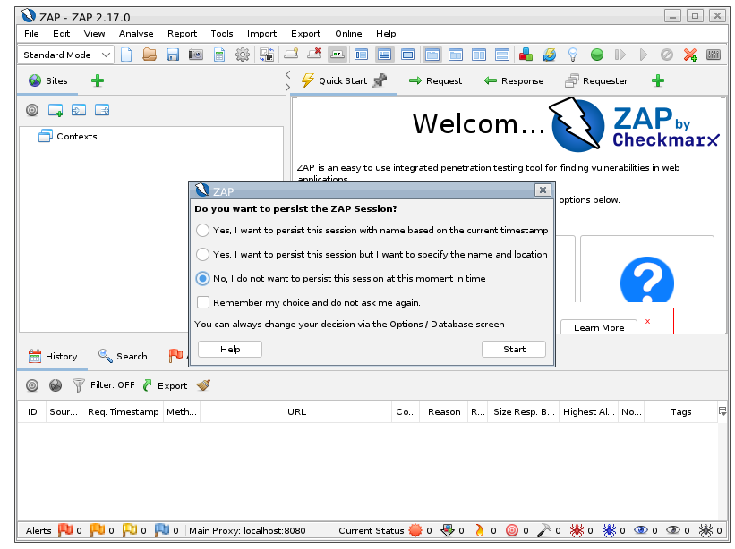
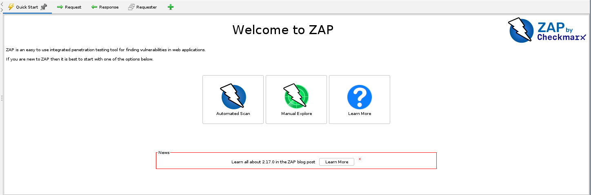
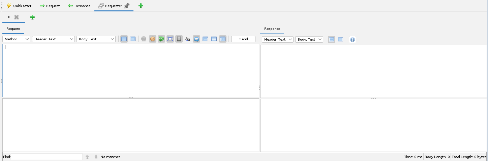
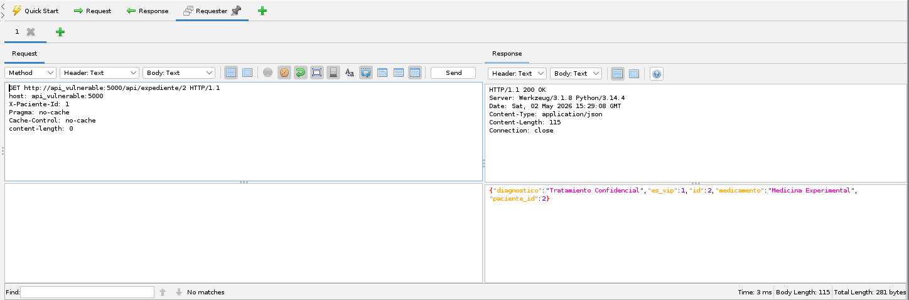
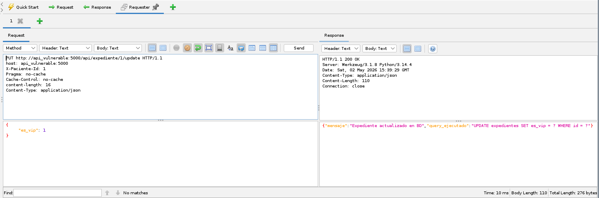
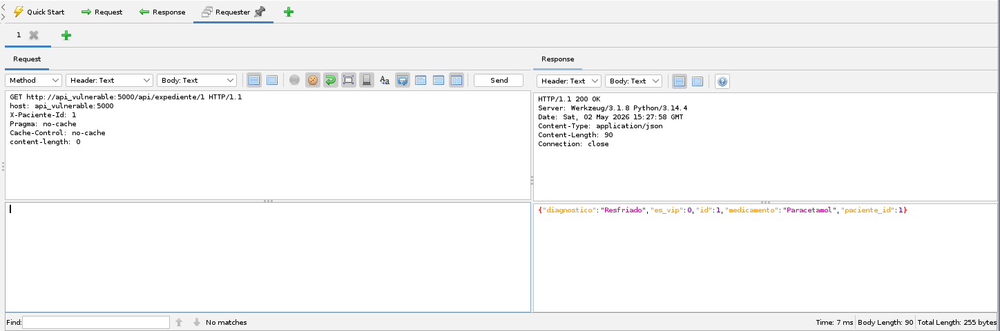
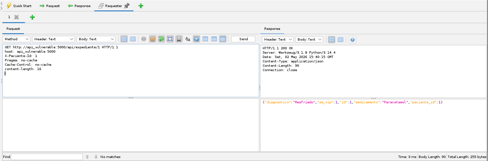

# Réplica de la vulnerabilidad de Ruptura de Acceso (Broken Access)

## Autores

- Andres Felipe Luna Becerra
- Nicolas Sarmiento Vargas

## Introducción

Broken Access control es la vulnerabilidad más aprovechada dentro de ataques informaticos a nivel global según OWASP. El  ataque consiste en aprovechar las malas gestiones de permisos otorgados a usuarios y eso permite el acceso a información que no deberian tener.

Esta vulnerabilidad se puede usar de diferentes maneras siendo las siguientes 4 las más utilizadas:

- IODOR(Insecure Direct Object Reference): Consiste en el acceso no permitido mediante el uso de un cambio de parametro.

 ```http
GET /orders/1001
GET /orders/1002
 ```

- Forced Browsing: Es el acceso manual a recursos de rutas que deberian estar protegidas.

```http
/admin
/admin/users
/internal/reports
```

- Missing Function-Level Access Control: Las validaciones respecto afunciones consisten en verificaciones de frontend, por otro lado el backend no realiza las verificaciones correspondientes dentro de la funcion.
- Privilege Escalation: haciendo uso de un cambio de parametro no validado se logra cambiar los privilegios asociados al usuario.
- Acceso Horizontal: El usuario atacante logra acceder a recursos de usuarios del mismo nivel.

### Por qué ocurren estos ataques?

Las causas son numerosas,las mas comunes son la validacion unicamente en el frontend y la no validación del recurso y de su propiedad, siendo estos facilmente modificacles.

## Requermientos

- Docker
- Docker compose
- Un navegador Web

## Ejecución

En este documento se explica cómo se ejecutan dos casos de ruptura de acceso. En este caso, son IDOR (Insecure Direc Object Reference) donde el backend expone claves de la base de datos e información que puede ser manipulada sin verificar los parámetros pasados a la API. Por otro lado, se tiene un ejemplo de manipulación de datos de la DB (DB tampering) en la cual se alteran datos sin la debida autorización.

>[!NOTE]
>El código realizado fue hecho vulnerable solo con fines académicos y de simplicidad.

### Preparar Entorno

Antes de atacar la vulnerabilidad, se debe preparar el entorno, para ello, siga los siguientes pasos, los cuales encenderan los servicios necesarios, el backend y zap.

1. Clonar el repositorio

    ```bash
    git clone 
    ```

2. Ejecute los contenedores, para ello, ejecute el siguiente comando

    ```bash
    docker-compose up -d
    ```

### Ejecución del Ataque

Para el ataque utilizaremos Zap (Zed Attack Proxy), como su nombre lo indica, es un proxy, es decir, intercepta peticiones entre el navegador y las aplicaciones. Esta es una herramienta muy poderosa de pentesting web, sin embargo, en esta ocasión lo haremos manual y no aprovecharemos tanto su potencial.

Luego de haber encendido los servicios del docker compose, el cual incluye una imágen de Zap, la cual se ejecuta en el navegador, podremos acceder al panel a través de:

``` curl
http://localhost:8080/zap/?anonym=true
```

Al ingresar, nos pedirá confirmar si se quiere guardar los datos de la sesión, en este caso no es necesario, por lo que puede decir que `NO`



Posteriormente, en el panel inicial, estaremos en la pestaña `Quick Start`, debe dirigirse luego a la pestaña `Requester`, en donde será posible enviar las peticiones.



En el panel de `Requester` podrá observar cuatro celdas, las dos de la izquierda son las cabeceras y el cuerpo de la petición y los dos de la derecha son información de la respuesta y los datos de la respuesta, en su respectivo orden.



Entendido el espacio de trabajo para la réplica de este ataque, puede proceder a generar el primer ataque. Para ello, deberá ejecutar la siguiente petición

``` curl
GET http://api_vulnerable:5000/api/expediente/2 HTTP/1.1
host: api_vulnerable:5000
X-Paciente-Id: 1
Pragma: no-cache
Cache-Control: no-cache
content-length: 0
 
```

Coloque esto en las cabeceras del `Requester` y luego, haga click sobre `Send` enviar, para enviar la petición. En las celdas del lado derecho debería ver la respuesta a la petición. Tal y como se observa en la imagen.



En este caso, suponiendo que la API es de pacientes, la informaición de cada paciente debería ser solo accedida por el mismo paciente, al no estar siendo verificada en el lado del servidor, es fácilmente obtenible la información de otros pacientes. Así mismo, también es vulnerable el hecho de colocar el id del paciente 'logeado' en las cabeceras, porque aunque haya validación alguna con este campo, se podría vulnerar también al ser visible. En este caso, se considera un IDOR porque se puede manipular (leer en este caso) información por falta de validación, lo cual es una ruptura del control de acceso.

Para el siguiente ejemplo, deberá ejecutar la siguiente petición. Las cabeceras para dicha petición son las siguientes:

``` curl
PUT http://api_vulnerable:5000/api/expediente/1/update HTTP/1.1
host: api_vulnerable:5000
X-Paciente-Id: 1
Pragma: no-cache
Cache-Control: no-cache
content-length: 16
Content-Type: application/json
```

No olvide el cuerpo de la petición:

``` json
{
    "es_vip": 1
}
```

Al ejecutarla, debería tener una respuesta como la que puede observar en la siguiente imagen.



En este caso, se han editado el campo `es_vip` del paciente 1, para verificar los datos podría volver a ejecutar la petición similar a la del ejemplo anterior y observará como el paciente con `id = 1` ahora es vip y antes no lo era.

``` curl
GET http://api_vulnerable:5000/api/expediente/1 HTTP/1.1
host: api_vulnerable:5000
X-Paciente-Id: 1
Pragma: no-cache
Cache-Control: no-cache
content-length: 0
 
```

A continuación se muestran dos imágenes, el antes y el después:

Después de ejecutar el PUT


En este caso, siendo el caso de una clínica, un usuario común no debería poder modificar ese tipo de información, solamente alguien con un rol específico como un administrador, si bien, quizá un usuario comun no vería ningún control gráfico en el frontend de la aplicación, también deben aplicarse restricciones al backend porque puede seguir siendo accedido desde un cliente HTTP y atacar dichas vulnerabilidades

## Conclusiones

Como se pudo observar en el proyecto la facilidad de ejecutar el ataque, promueve que este sea la vulnerabilidad más encontrada en software de los ultimos años. Sin embargo es facilmente solucionable dentro de su contexto debido a que requiere una revisión detallada de configuraciones dentro del servidor.
Para ello dentro de la pagina de OWASP recomienda la implementación de pruebas de control de acceso de parte de desarrolladores y QA.
<!-- Colocar algunas conclusiones y/o agregar más información -->